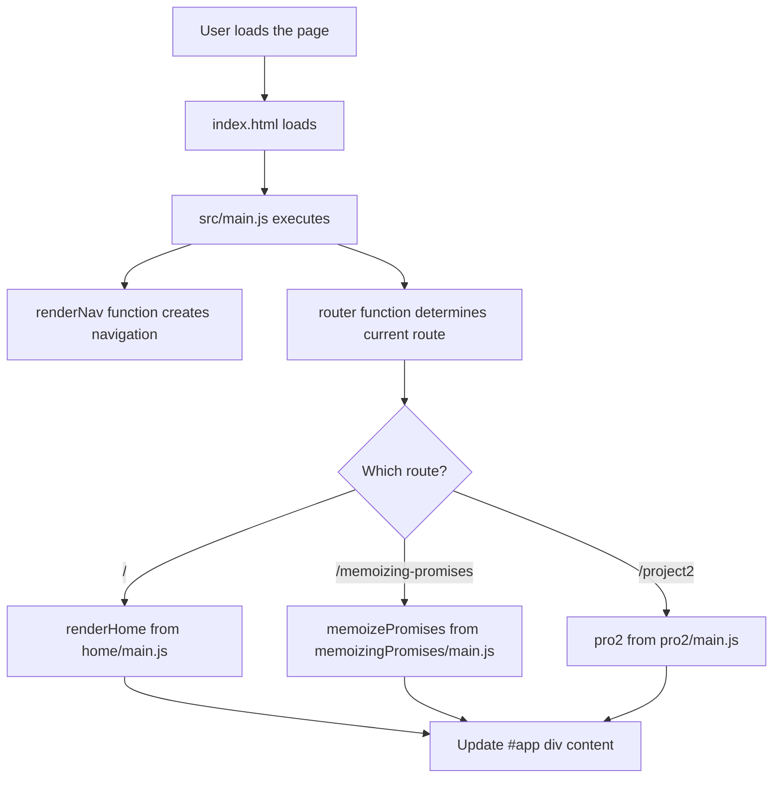

# VanillaJS Projects 
- Cache API Calls in JavaScript by Memoizing Promises. [Here](./src/memoizingPromises/).

## File Directory Setup

```mermaid
graph TD;
    A[User loads the page] --> B[index.html loads]
    B --> C[src/main.js executes]
    C --> D[renderNav function creates navigation]
    C --> E[router function determines current route]
    E --> F{Which route?}
    F -->|"/"| G[renderHome from home/main.js]
    F -->|"/memoizing-promises"| H[memoizePromises from memoizingPromises/main.js]
    F -->|"/project2"| I[pro2 from pro2/main.js]
    G --> J[Update #app div content]
    H --> J
    I --> J
```